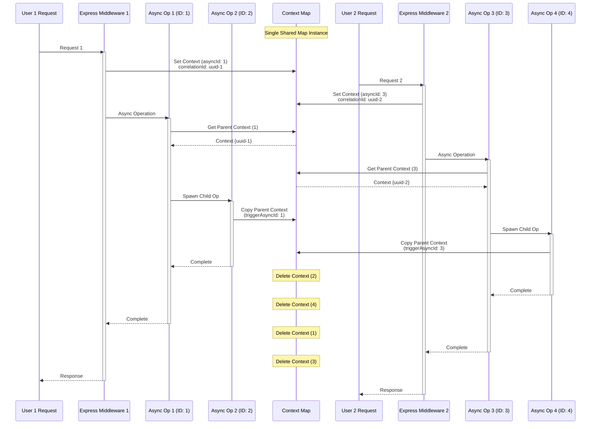
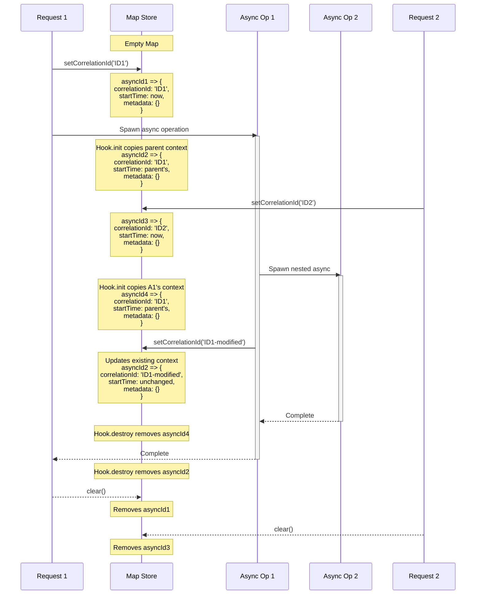

```mermaid
sequenceDiagram
    participant U1 as User 1 Request
    participant E1 as Express Middleware 1
    participant A1 as Async Op 1 (ID: 1)
    participant A2 as Async Op 2 (ID: 2)
    participant M1 as Context Map
    participant U2 as User 2 Request
    participant E2 as Express Middleware 2
    participant A3 as Async Op 3 (ID: 3)
    participant A4 as Async Op 4 (ID: 4)

    Note over M1: Single Shared Map Instance

    U1->>E1: Request 1
    activate E1
    E1->>M1: Set Context (asyncId: 1)<br/>correlationId: uuid-1

    U2->>E2: Request 2
    activate E2
    E2->>M1: Set Context (asyncId: 3)<br/>correlationId: uuid-2

    E1->>A1: Async Operation
    activate A1
    A1->>M1: Get Parent Context (1)
    M1-->>A1: Context {uuid-1}

    E2->>A3: Async Operation
    activate A3
    A3->>M1: Get Parent Context (3)
    M1-->>A3: Context {uuid-2}

    A1->>A2: Spawn Child Op
    activate A2
    A2->>M1: Copy Parent Context<br/>(triggerAsyncId: 1)

    A3->>A4: Spawn Child Op
    activate A4
    A4->>M1: Copy Parent Context<br/>(triggerAsyncId: 3)

    A2-->>A1: Complete
    deactivate A2
    Note over M1: Delete Context (2)

    A4-->>A3: Complete
    deactivate A4
    Note over M1: Delete Context (4)

    A1-->>E1: Complete
    deactivate A1
    Note over M1: Delete Context (1)

    A3-->>E2: Complete
    deactivate A3
    Note over M1: Delete Context (3)

    E1-->>U1: Response
    deactivate E1

    E2-->>U2: Response
    deactivate E2
```

```mermaid
sequenceDiagram
    participant R1 as Request 1
    participant M as Map Store
    participant A1 as Async Op 1
    participant A2 as Async Op 2
    participant R2 as Request 2

    Note over M: Empty Map

    R1->>M: setCorrelationId('ID1')
    Note over M: asyncId1 => {<br/>correlationId: 'ID1',<br/>startTime: now,<br/>metadata: {}<br/>}

    R1->>A1: Spawn async operation
    activate A1
    Note over M: Hook.init copies parent context<br/>asyncId2 => {<br/>correlationId: 'ID1',<br/>startTime: parent's,<br/>metadata: {}<br/>}

    R2->>M: setCorrelationId('ID2')
    Note over M: asyncId3 => {<br/>correlationId: 'ID2',<br/>startTime: now,<br/>metadata: {}<br/>}

    A1->>A2: Spawn nested async
    activate A2
    Note over M: Hook.init copies A1's context<br/>asyncId4 => {<br/>correlationId: 'ID1',<br/>startTime: parent's,<br/>metadata: {}<br/>}

    A1->>M: setCorrelationId('ID1-modified')
    Note over M: Updates existing context<br/>asyncId2 => {<br/>correlationId: 'ID1-modified',<br/>startTime: unchanged,<br/>metadata: {}<br/>}

    A2-->>A1: Complete
    deactivate A2
    Note over M: Hook.destroy removes asyncId4

    A1-->>R1: Complete
    deactivate A1
    Note over M: Hook.destroy removes asyncId2

    R1-->>M: clear()
    Note over M: Removes asyncId1

    R2-->>M: clear()
    Note over M: Removes asyncId3
```
