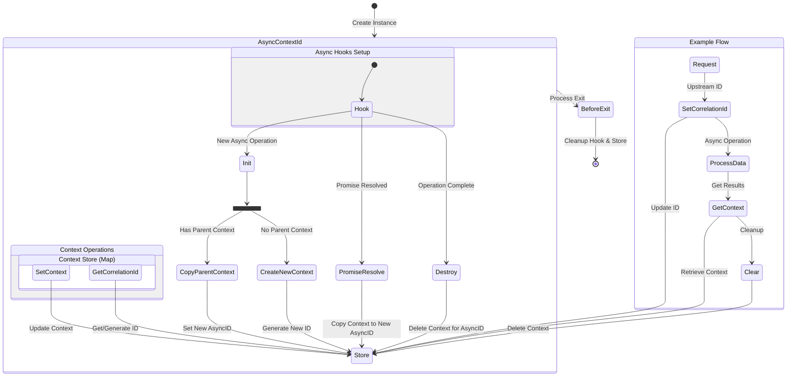

## How It Works

This library uses Node.js's `async_hooks` module to track async operations:

## Flow Diagram Explanation

### Instance Creation

* Program starts by creating a singleton `AsyncContextId` instance
* Sets up async hooks and initializes the context store (Map)

### Async Hooks Setup

* Hook listens for three main events:
  * `init`: When new async operations are created
  * `promiseResolve`: When promises are resolved
  * `destroy`: When async operations complete

### Context Operations

Custom data is stored in the `meta` attribute. All context / `meta`
operations use deep cloning to ensure isolation between async operations.

* Main operations on the context store:
  * `setContext`: Updates context for current async ID
  * `getContext`: Retrieves context for current async ID
  * `setCorrelationId`: Sets/updates correlation ID
  * `getCorrelationId`: Gets or generates correlation ID
  * `clear`: Removes context for current async ID

### Context Propagation

* When a new async operation starts:
  * If parent context exists, it's copied to new async ID
  * If no parent context, new context is created with generated ID
* When promises resolve, context is copied to new async ID
* When operations complete, context is cleaned up

### Cleanup

* On process exit:
  * Disables async hooks
  * Clears context store
  * Removes event listeners

### Example Flow

* Shows typical request handling:
  * Set correlation ID from upstream
  * Process data asynchronously
  * Retrieve context for logging
  * Clear context when done

