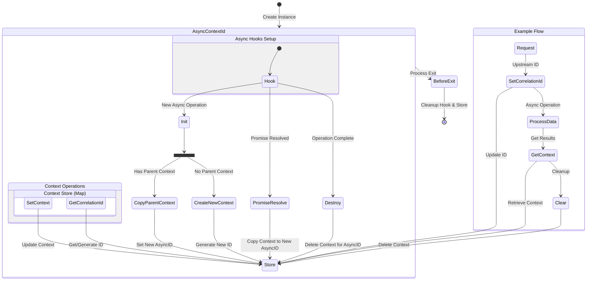

# [async-context-id](https://github.com/psenger/async-context-id#readme)

> [!TAG]
> 0.0.1

A lightweight, powerful correlation ID tracking and context store written for Node.js that automatically propagates context through async operations using Node's `async_hooks`. Perfect for distributed tracing, request tracking, and logging correlation in micro services architectures.

## Table of Contents

<!-- toc -->

- [Features](#features)
- [Installation](#installation)
- [How It Works](#how-it-works)
- [Flow Diagram Explanation](#flow-diagram-explanation)
  * [Instance Creation](#instance-creation)
  * [Async Hooks Setup](#async-hooks-setup)
  * [Context Operations](#context-operations)
  * [Context Propagation](#context-propagation)
  * [Cleanup](#cleanup)
  * [Example Flow](#example-flow)
- [API](#api)
  * [Modules](#modules)
  * [Classes](#classes)
  * [@psenger/async-context-id](#psengerasync-context-id)
  * [AsyncContextId](#asynccontextid)
    + [new AsyncContextId([options])](#new-asynccontextidoptions)
    + [asyncContextId.cleanUpFn()](#asynccontextidcleanupfn)
    + [asyncContextId.getCorrelationId() ⇒ string](#asynccontextidgetcorrelationid-%E2%87%92-string)
    + [asyncContextId.setCorrelationId(correlationId)](#asynccontextidsetcorrelationidcorrelationid)
    + [asyncContextId.getContext() ⇒ Object \| string \| number \| Object](#asynccontextidgetcontext-%E2%87%92-object--string--number--object)
    + [asyncContextId.setContext([context])](#asynccontextidsetcontextcontext)
    + [asyncContextId.clear()](#asynccontextidclear)
  * [LruMap ⇐ Map](#lrumap-%E2%87%90-map)
    + [new LruMap(maxSize)](#new-lrumapmaxsize)
    + [lruMap.set(key, value) ⇒ this](#lrumapsetkey-value-%E2%87%92-this)
  * [TimedMap ⇐ Map](#timedmap-%E2%87%90-map)
    + [new TimedMap(ttl)](#new-timedmapttl)
    + [timedMap.set(key, value) ⇒ this](#timedmapsetkey-value-%E2%87%92-this)
    + [timedMap.delete(key) ⇒ boolean](#timedmapdeletekey-%E2%87%92-boolean)
- [Usage](#usage)
  * [Enhanced Logging with Console Monkey Patching](#enhanced-logging-with-console-monkey-patching)
  * [Express Middleware](#express-middleware)
    + [`correlation-middleware.js`](#correlation-middlewarejs)
    + [`app.js`](#appjs)
    + [`simple-controller.js`](#simple-controllerjs)
  * [Winston Logger Integration](#winston-logger-integration)
- [‼️ Caution - Memory Management Strategies](#%E2%80%BC%EF%B8%8F-caution---memory-management-strategies)
- [‼️ Caution - Correlation ID with `UUID`](#%E2%80%BC%EF%B8%8F-caution---correlation-id-with-uuid)
- [‼️ Limitations](#%E2%80%BC%EF%B8%8F-limitations)
  * [Untested pattern - **Process Next Tick**](#untested-pattern---process-next-tick)
  * [Untested pattern - **Node.js Core Module Callbacks** (like fs, http, etc.):](#untested-pattern---nodejs-core-module-callbacks-like-fs-http-etc)
  * [Solution to Untested pattern](#solution-to-untested-pattern)
- [Contributing](#contributing)
  * [Rules](#rules)
  * [Commit Message](#commit-message)
  * [Testing](#testing)
- [License](#license)
- [Acknowledgments](#acknowledgments)
  * [Dependencies](#dependencies)
  * [Development Dependencies](#development-dependencies)

<!-- tocstop -->

## Features

- Automatic context propagation through async operations
- Thread-local-like storage for Node.js
- UUID v4 based correlation IDs
- ️ Thread-safe context isolation
- Deep cloning of context data
- Automatic cleanup of contexts
- Zero dependencies (uses only Node.js built-ins)

<!--START_SECTION:file:INSTALLATION.md-->
## Installation

**NPM**

```shell
npm install @psenger/async-context-id --save
```
**YARN**

```shell
yarn add @psenger/async-context-id
```

<!--END_SECTION:file:INSTALLATION.md-->

<!--START_SECTION:file:HOWITWORKS.md-->
## How It Works

This library uses Node.js's `async_hooks` module to track async operations:



## Flow Diagram Explanation

### Instance Creation

* Program starts by creating a singleton `AsyncContextId` instance
* Sets up async hooks and initializes the context store (Map)

### Async Hooks Setup

* Hook listens for three main events:
  * `init`: When new async operations are created
  * `promiseResolve`: When promises are resolved
  * `destroy`: When async operations complete

### Context Operations

Custom data is stored in the `meta` attribute. All context / `meta`
operations use deep cloning to ensure isolation between async operations.

* Main operations on the context store:
  * `setContext`: Updates context for current async ID
  * `getContext`: Retrieves context for current async ID
  * `setCorrelationId`: Sets/updates correlation ID
  * `getCorrelationId`: Gets or generates correlation ID
  * `clear`: Removes context for current async ID

### Context Propagation

* When a new async operation starts:
  * If parent context exists, it's copied to new async ID
  * If no parent context, new context is created with generated ID
* When promises resolve, context is copied to new async ID
* When operations complete, context is cleaned up

### Cleanup

* On process exit:
  * Disables async hooks
  * Clears context store
  * Removes event listeners

### Example Flow

* Shows typical request handling:
  * Set correlation ID from upstream
  * Process data asynchronously
  * Retrieve context for logging
  * Clear context when done


<!--END_SECTION:file:HOWITWORKS.md-->

<!--START_SECTION:jsdoc-->
## API

### Modules

<table>
  <thead>
    <tr>
      <th>Module</th><th>Description</th>
    </tr>
  </thead>
  <tbody>
<tr>
    <td><a href="#module_@psenger/async-context-id">@psenger/async-context-id</a></td>
    <td><p>A lightweight, powerful correlation ID tracking and context store.</p>
</td>
    </tr>
</tbody>
</table>

### Classes

<table>
  <thead>
    <tr>
      <th>Global</th><th>Description</th>
    </tr>
  </thead>
  <tbody>
<tr>
    <td><a href="#AsyncContextId">AsyncContextId</a></td>
    <td><p>A singleton class that tracks correlation IDs across asynchronous operations in Node.js.
Uses async_hooks to automatically propagate correlation context across async boundaries.</p>
</td>
    </tr>
<tr>
    <td><a href="#LruMap">LruMap</a> ⇐ <code>Map</code></td>
    <td><p>A Map extension implementing Least Recently Used (LRU) caching strategy.
Automatically removes oldest entries when size limit is reached.</p>
</td>
    </tr>
<tr>
    <td><a href="#TimedMap">TimedMap</a> ⇐ <code>Map</code></td>
    <td><p>A Map extension that automatically deletes entries after a specified time-to-live (TTL).</p>
</td>
    </tr>
</tbody>
</table>

<a name="module_@psenger/async-context-id"></a>

### @psenger/async-context-id
A lightweight, powerful correlation ID tracking and context store.

<a name="AsyncContextId"></a>

### AsyncContextId
A singleton class that tracks correlation IDs across asynchronous operations in Node.js.
Uses async_hooks to automatically propagate correlation context across async boundaries.

**Kind**: global class  
**Properties**

| Name | Type | Description |
| --- | --- | --- |
| contextStore | <code>Map</code> | Storage for async context data |
| hook | <code>AsyncHook</code> | The async_hooks instance for tracking async operations |
| cleanUpFn | <code>function</code> | Cleanup function registered for process exit |


* [AsyncContextId](#AsyncContextId)
    * [new AsyncContextId([options])](#new_AsyncContextId_new)
    * [.cleanUpFn()](#AsyncContextId+cleanUpFn)
    * [.getCorrelationId()](#AsyncContextId+getCorrelationId) ⇒ <code>string</code>
    * [.setCorrelationId(correlationId)](#AsyncContextId+setCorrelationId)
    * [.getContext()](#AsyncContextId+getContext) ⇒ <code>Object</code> \| <code>string</code> \| <code>number</code> \| <code>Object</code>
    * [.setContext([context])](#AsyncContextId+setContext)
    * [.clear()](#AsyncContextId+clear)

<a name="new_AsyncContextId_new"></a>

#### new AsyncContextId([options])
This class provides context propagation across async operations in Node.js
applications. It maintains correlation IDs and metadata throughout the async execution chain.

**Returns**: [<code>AsyncContextId</code>](#AsyncContextId) - The singleton instance  

| Param | Type | Default | Description |
| --- | --- | --- | --- |
| [options] | <code>Object</code> | <code>{}</code> | Configuration options |
| [options.store] | <code>Map</code> | <code>new Map()</code> | Optional Map instance for context storage, this package includes both a LRU ( Least Recently Used ) Map and a Timed Map. |
| [options.correlationIdFn] | <code>fn</code> |  | Optional function to override default UUID generation. Should return a string |

**Example**  
```js
// Using default Map and UUID generation
const tracker = new AsyncContextId();
```
**Example**  
```js
// Using custom LRU Map and correlation ID generator
const tracker = new AsyncContextId({
  store: new LruMap(1000),
  correlationIdFn: () => `custom-${Date.now()}`
});
```
<a name="AsyncContextId+cleanUpFn"></a>

#### asyncContextId.cleanUpFn()
remove the listener of itself to prevent memory leaks

**Kind**: instance method of [<code>AsyncContextId</code>](#AsyncContextId)  
<a name="AsyncContextId+getCorrelationId"></a>

#### asyncContextId.getCorrelationId() ⇒ <code>string</code>
Retrieves the correlation ID for the current async context.
Creates a new context with generated ID if none exists.

**Kind**: instance method of [<code>AsyncContextId</code>](#AsyncContextId)  
**Returns**: <code>string</code> - The current correlation ID  
**Throws**:

- <code>Error</code> If async hooks are not enabled

**Example**  
```js
const correlationId = tracker.getCorrelationId();
res.setHeader('x-correlation-id', correlationId);
```
<a name="AsyncContextId+setCorrelationId"></a>

#### asyncContextId.setCorrelationId(correlationId)
Sets the correlation ID for the current async context.
Creates a new context if none exists.

**Kind**: instance method of [<code>AsyncContextId</code>](#AsyncContextId)  
**Throws**:

- <code>Error</code> If the correlationId is not a string
- <code>Error</code> If async hooks are not enabled


| Param | Type | Description |
| --- | --- | --- |
| correlationId | <code>string</code> | The correlation ID to set |

**Example**  
```js
const upstreamId = req.headers['x-correlation-id'];
if (upstreamId) {
  tracker.setCorrelationId(upstreamId);
}
```
<a name="AsyncContextId+getContext"></a>

#### asyncContextId.getContext() ⇒ <code>Object</code> \| <code>string</code> \| <code>number</code> \| <code>Object</code>
Retrieves the complete context object for the current async operation.
Creates a new context if none exists.

**Kind**: instance method of [<code>AsyncContextId</code>](#AsyncContextId)  
**Returns**: <code>Object</code> - The correlation context<code>string</code> - context.correlationId - The correlation ID<code>number</code> - context.startTime - Unix timestamp of context creation<code>Object</code> - context.metadata - Custom metadata object  
**Throws**:

- <code>Error</code> If async hooks are not enabled

**Example**  
```js
const context = tracker.getContext();
console.log({
  correlationId: context.correlationId,
  duration: Date.now() - context.startTime,
  metadata: context.metadata
});
```
<a name="AsyncContextId+setContext"></a>

#### asyncContextId.setContext([context])
Updates the context for the current async operation.
Creates a new context if none exists. Preserves existing correlationId
and startTime unless explicitly overridden.

**Kind**: instance method of [<code>AsyncContextId</code>](#AsyncContextId)  
**Throws**:

- <code>Error</code> If async hooks are not enabled
- <code>Error</code> If context is not an object


| Param | Type | Default | Description |
| --- | --- | --- | --- |
| [context] | <code>Object</code> | <code>{}</code> | The context object to merge |
| [context.correlationId] | <code>string</code> |  | Optional correlation ID override |
| [context.metadata] | <code>Object</code> |  | Optional metadata to merge |

**Example**  
```js
// Add request context
tracker.setContext({
  metadata: {
    operation: 'processData',
    requestId: req.id,
    userId: req.user.id
  }
});
```
<a name="AsyncContextId+clear"></a>

#### asyncContextId.clear()
Removes the correlation context for the current async operation.

**Kind**: instance method of [<code>AsyncContextId</code>](#AsyncContextId)  
**Throws**:

- <code>Error</code> If async hooks are not enabled

**Example**  
```js
try {
  await processRequest(data);
} finally {
  tracker.clear();
}
```
<a name="LruMap"></a>

### LruMap ⇐ <code>Map</code>
A Map extension implementing Least Recently Used (LRU) caching strategy.
Automatically removes oldest entries when size limit is reached.

**Kind**: global class  
**Extends**: <code>Map</code>  

* [LruMap](#LruMap) ⇐ <code>Map</code>
    * [new LruMap(maxSize)](#new_LruMap_new)
    * [.set(key, value)](#LruMap+set) ⇒ <code>this</code>

<a name="new_LruMap_new"></a>

#### new LruMap(maxSize)
Creates an LRU cache with specified maximum size.


| Param | Type | Description |
| --- | --- | --- |
| maxSize | <code>number</code> | Maximum number of entries |

**Example**  
```js
const cache = new LruMap(3);
cache.set('a', 1).set('b', 2).set('c', 3);
cache.set('d', 4); // Removes 'a', now contains b,c,d
```
<a name="LruMap+set"></a>

#### lruMap.set(key, value) ⇒ <code>this</code>
Sets a value, removing oldest entry if size limit reached.

**Kind**: instance method of [<code>LruMap</code>](#LruMap)  
**Returns**: <code>this</code> - The LruMap instance for chaining  

| Param | Type | Description |
| --- | --- | --- |
| key | <code>\*</code> | The key to set |
| value | <code>\*</code> | The value to store |

**Example**  
```js
const cache = new LruMap(2);
cache.set('key1', 'value1')
     .set('key2', 'value2')
     .set('key3', 'value3'); // Removes key1
```
<a name="TimedMap"></a>

### TimedMap ⇐ <code>Map</code>
A Map extension that automatically deletes entries after a specified time-to-live (TTL).

**Kind**: global class  
**Extends**: <code>Map</code>  

* [TimedMap](#TimedMap) ⇐ <code>Map</code>
    * [new TimedMap(ttl)](#new_TimedMap_new)
    * [.set(key, value)](#TimedMap+set) ⇒ <code>this</code>
    * [.delete(key)](#TimedMap+delete) ⇒ <code>boolean</code>

<a name="new_TimedMap_new"></a>

#### new TimedMap(ttl)
Creates a new TimedMap instance.


| Param | Type | Description |
| --- | --- | --- |
| ttl | <code>number</code> | Time-to-live in milliseconds for each key-value pair |

**Example**  
```js
const cache = new TimedMap(5000); // 5 second TTL
cache.set('key1', 'value1');
console.log(cache.get('key1')); // 'value1'
// After 5 seconds:
console.log(cache.get('key1')); // undefined
```
**Example**  
```js
// Resetting TTL on value update
const cache = new TimedMap(2000);
cache.set('user', { name: 'Alice' });
// 1 second later:
cache.set('user', { name: 'Alice', age: 30 }); // Resets the 2-second timer
```
<a name="TimedMap+set"></a>

#### timedMap.set(key, value) ⇒ <code>this</code>
Sets a value in the map with an automatic deletion timer.
If the key already exists, its timer is reset.

**Kind**: instance method of [<code>TimedMap</code>](#TimedMap)  
**Returns**: <code>this</code> - The TimedMap instance for chaining  

| Param | Type | Description |
| --- | --- | --- |
| key | <code>\*</code> | The key to set |
| value | <code>\*</code> | The value to store |

**Example**  
```js
const cache = new TimedMap(10000);
cache.set('apiKey', 'xyz123')
     .set('timestamp', Date.now());
```
<a name="TimedMap+delete"></a>

#### timedMap.delete(key) ⇒ <code>boolean</code>
Deletes a key-value pair and its associated timer.

**Kind**: instance method of [<code>TimedMap</code>](#TimedMap)  
**Returns**: <code>boolean</code> - True if the element was deleted, false if it didn't exist  

| Param | Type | Description |
| --- | --- | --- |
| key | <code>\*</code> | The key to delete |

**Example**  
```js
const cache = new TimedMap(5000);
cache.set('temp', 'data');
cache.delete('temp'); // Manually delete before TTL expires
```

<!--END_SECTION:jsdoc-->

<!--START_SECTION:file:USAGE.md-->
## Usage

### Enhanced Logging with Console Monkey Patching

This example demonstrates how to automatically inject correlation IDs into console logs
using [monkey patching](https://en.wikipedia.org/wiki/Monkey_patch). The code below
intercepts standard console methods and prepends each log message with its log level
and correlation ID.

eg `LOG-LEVEL CORRELATION-ID`

<!--START_CODE_FENCE_SECTION:javascript:file:examples/monkey-patch-logs.js-->
```javascript
const fs = require('fs')
const path = require('path')
const util = require('util')
const {AsyncContextId} = require('../dist/index')
const TRACKER = new AsyncContextId()
const logFile = path.join(__dirname, 'app.log')
const original = {
  log: console.log,
  error: console.error,
  warn: console.warn,
  debug: console.debug,
  info: console.info
}
try {
  if (fs.existsSync(logFile)) {
    fs.writeFileSync(logFile, '')
  }
} catch (err) {
  console.error('Error handling log file:', err)
}
function formatApacheErrorTimestamp(date = new Date()) {
  const days = ['Sun', 'Mon', 'Tue', 'Wed', 'Thu', 'Fri', 'Sat']
  const months = ['Jan', 'Feb', 'Mar', 'Apr', 'May', 'Jun', 'Jul', 'Aug', 'Sep', 'Oct', 'Nov', 'Dec']
  return `[${days[date.getDay()]} ${months[date.getMonth()]} ${String(date.getDate()).padStart(2, '0')} ` +
    `${String(date.getHours()).padStart(2, '0')}:${String(date.getMinutes()).padStart(2, '0')}:` +
    `${String(date.getSeconds()).padStart(2, '0')}.${String(date.getMilliseconds()).padStart(3, '0')} ` +
    `${date.getFullYear()}]`
}
Object.keys(original).forEach(method => {
  console[method] = function (...args) {
    const prefix = `${formatApacheErrorTimestamp()} [${method.toLowerCase()}] [${TRACKER.getContext().correlationId}] ${TRACKER.getContext()?.metadata?.fullName} `
    if (typeof args[0] === 'string') {
      args[0] = prefix + args[0]
    } else {
      args.unshift(prefix)
    }
    original[method].apply(console, args)
    fs.appendFileSync(logFile, util.format(...args) + '\n')
  }
})

```
<!--END_CODE_FENCE_SECTION:javascript:file:examples/monkey-patch-logs.js-->

### Express Middleware

This Express middleware automatically manages correlation IDs across HTTP requests. It
extracts the correlation ID from incoming request headers, propagates it through the
request lifecycle, and includes it in the response headers.

**Note:** Register this middleware early in your Express application's middleware chain
to ensure correlation IDs are available throughout the entire request lifecycle.

#### `correlation-middleware.js`

<!--START_CODE_FENCE_SECTION:javascript:file:examples/correlation-middleware.js-->
```javascript
const {AsyncContextId} = require('../dist/index') // '@psenger/async-context-id'
const asyncContextId = new AsyncContextId()
const correlationMiddleware = () => (req, res, next) => {
  try {
    asyncContextId.clear()
    let correlationId = req.headers['x-correlation-id']
    correlationId = asyncContextId.setCorrelationId(correlationId)
    res.setHeader('x-correlation-id', correlationId)
    res.on('finish', () => {
      asyncContextId.clear()
    })
    next()
  } catch (error) {
    next(error)
  }
}
module.exports = correlationMiddleware

```
<!--END_CODE_FENCE_SECTION:javascript:file:examples/correlation-middleware.js-->

#### `app.js`

<!--START_CODE_FENCE_SECTION:javascript:file:examples/app.js-->
```javascript
const express = require('express')
const app = express()
const router = express.Router()
const {systemTimer} = require('./timer')
const controller = require('./controller')
const correlationMiddleware = require('./correlation-middleware')
require('./monkey-patch-logs')
systemTimer()
app.use(express.json())
app.use(express.urlencoded({extended: false}))
app.use(correlationMiddleware())
router.post('/:id', controller)
app.use('/', router)
module.exports = app

```
<!--END_CODE_FENCE_SECTION:javascript:file:examples/app.js-->

#### `simple-controller.js`

<!--START_CODE_FENCE_SECTION:javascript:file:examples/simple-controller.js-->
```javascript
const {AsyncContextId} = require('../dist/index') // '@psenger/async-context-id'
const TRACKER = new AsyncContextId()
module.exports = function (req, res) {
  const id = req.params.id
  const correlationId = TRACKER.getContext().correlationId
  console.log(`${correlationId} saw ${id} in controller`)
  TRACKER.setContext({
    metadata: {
      id,
    }
  })
  // do something else here which will expose meta upstream
}

```
<!--END_CODE_FENCE_SECTION:javascript:file:examples/simple-controller.js-->

### Winston Logger Integration

<!--START_CODE_FENCE_SECTION:javascript:file:examples/winston-logger.js-->
```javascript
const winston = require('winston')
const {AsyncContextId} = require('../dist/index') // '@psenger/async-context-id'

const TRACKER = new AsyncContextId()

const logger = winston.createLogger({
  format: winston.format.combine(
    winston.format.timestamp(),
    winston.format.json(),
    winston.format((info) => {
      const context = TRACKER.getContext();
      return {
        ...info,
        correlationId: context?.correlationId || 'no-correlation-id',
        metadata: context?.metadata || {}
      };
    })()
  ),
  transports: [
    new winston.transports.Console()
  ]
});

```
<!--END_CODE_FENCE_SECTION:javascript:file:examples/winston-logger.js-->

## ‼️ Caution - Memory Management Strategies

All scaling systems degrade when affected by memory leaks. This module hosts a single map
and addresses such leaks through two configurable Map implementations for context tracking:

* LRU (Least Recently Used) Map
* Timed Map

These maps can be configured during AsyncContextId initialization. As AsyncContextId operates
as a singleton, the map implementation must be set at creation and remains immutable.

## ‼️ Caution - Correlation ID with `UUID`

The default implementation of correlation ID uses non-cryptographic UUID generation to prevent recursive
async hook triggers that would otherwise occur with Node's Crypto module (internal crypto operations
would initiate new async hooks). Since this is based on UUID v4, it may be necessary for consumers
to increase the complexity of the correlation ID. Therefore, this functionality has been exposed as
an option ( `correlationIdFn` ).

e.g.
```javascript
// Safe UUID v4 implementation without Crypto
generateCorrelationId() {
  if (this.correlationIdFn) {
    return this.correlationIdFn()
  }
  return "xxxxxxxx-xxxx-4xxx-yxxx-xxxxxxxxxxxx".replace(/[xy]/g, (c) => {
    const r = (Math.random() * 16) | 0;
    const v = c === "x" ? r : (r & 0x3) | 0x8;
    return v.toString(16);
  });
}
```

## ‼️ Limitations

The async hooks implementation tracks context through EventEmitters, Timers, and Node.js
core callbacks. However, as async hooks remain experimental, context propagation should be
tested extensively in production like scenarios. In the event that something does not work as
expected, there are some untested patterns and suggested work around. Remember it is better
to error on the side of caution rather than create a memory leak.

### Untested pattern - **Process Next Tick**

```javascript
process.nextTick(() => {
    // context may get lost
    const context = tracker.getContext(); // will create new context
});
```

### Untested pattern - **Node.js Core Module Callbacks** (like fs, http, etc.):

```javascript
const fs = require('fs');
fs.readFile('somefile.txt', (err, data) => {
    // context may get lost
    const context = tracker.getContext(); // will create new context
});
```

### Solution to Untested pattern

Despite the untested patterns, these callbacks can be wrapped and bound. Word of caution, Arrow Functions
can not be bound therefore, you must use `function` declaration.

```javascript
class CorrelationTracker {
    bindCallback(fn) {
        const currentContext = this.getContext();
        return (...args) => {
            const asyncId = asyncHooks.executionAsyncId();
            this.correlationStore.set(asyncId, JSON.parse(JSON.stringify(currentContext)));
            try {
                return fn(...args);
            } finally {
                this.correlationStore.delete(asyncId);
            }
        };
    }
}

// Usage:
emitter.on('someEvent', tracker.bindCallback(() => {
    // context is preserved
    const context = tracker.getContext();
}));
```

2. Or use the async_hooks executionAsyncResource when available:

```javascript
const asyncHooks = require('async_hooks');
const { AsyncResource } = require('async_hooks');

class TrackedEmitter extends EventEmitter {
    emit(event, ...args) {
        const asyncResource = new AsyncResource(event);
        return asyncResource.runInAsyncScope(() => {
            return super.emit(event, ...args);
        });
    }
}
```

<!--END_SECTION:file:USAGE.md-->

<!--START_SECTION:file:CONTRIBUTING.md-->

## Contributing

Thanks for contributing! 😁 Here are some rules that will make your change to
markdown-fences fruitful.

### Rules

* Raise a ticket to the feature or bug can be discussed
* Pull requests are welcome, but must be accompanied by a ticket approved by the repo owner
* You are expected to add a unit test or two to cover the proposed changes.
* Please run the tests and make sure tests are all passing before submitting your pull request
* Do as the Romans do and stick with existing whitespace and formatting conventions (i.e., tabs instead of spaces, etc)
  * we have provided the following: `.editorconfig` and `.eslintrc`
  * Don't tamper with or change `.editorconfig` and `.eslintrc`
* Please consider adding an example under examples/ that demonstrates any new functionality

### Commit Message

This module uses [release-please](https://github.com/googleapis/release-please) which
needs commit messages to look like the following [Conventional Commits](https://www.conventionalcommits.org/en/v1.0.0/)

```
<type>[optional scope]: <description>

[optional body]

```

**type** is typically `fix`, `feat`. When **type** ends with a `!` or is `BREAKING CHANGE` it indicates this is a breaking change.

**type** should be followed by a short description, **<description>**

**optional body** can have more detail

### Testing

* All tests are expected to work
* Tests are based off of `dist/index.js` **NOT** your src code. Therefore, you should BUILD it first.
* Coverage should not go down, and I acknowledge it is very difficult to get the tests to 100%

<!--END_SECTION:file:CONTRIBUTING.md-->

## License

<!--START_SECTION:file:LICENSE-->
MIT License

Copyright (c) 2025 Philip A Senger

Permission is hereby granted, free of charge, to any person obtaining a copy
of this software and associated documentation files (the "Software"), to deal
in the Software without restriction, including without limitation the rights
to use, copy, modify, merge, publish, distribute, sublicense, and/or sell
copies of the Software, and to permit persons to whom the Software is
furnished to do so, subject to the following conditions:

The above copyright notice and this permission notice shall be included in all
copies or substantial portions of the Software.

THE SOFTWARE IS PROVIDED "AS IS", WITHOUT WARRANTY OF ANY KIND, EXPRESS OR
IMPLIED, INCLUDING BUT NOT LIMITED TO THE WARRANTIES OF MERCHANTABILITY,
FITNESS FOR A PARTICULAR PURPOSE AND NONINFRINGEMENT. IN NO EVENT SHALL THE
AUTHORS OR COPYRIGHT HOLDERS BE LIABLE FOR ANY CLAIM, DAMAGES OR OTHER
LIABILITY, WHETHER IN AN ACTION OF CONTRACT, TORT OR OTHERWISE, ARISING FROM,
OUT OF OR IN CONNECTION WITH THE SOFTWARE OR THE USE OR OTHER DEALINGS IN THE
SOFTWARE.

<!--END_SECTION:file:LICENSE-->

<!--START_SECTION:file:THIRD_PARTY_NOTICES.md-->

## Acknowledgments

This project directly uses the following open-source packages:

### Dependencies

- None

### Development Dependencies

- [@psenger/markdown-fences](https://github.com/psenger/markdown-fences) - MIT License
- [eslint-config-prettier](https://github.com/prettier/eslint-config-prettier) - MIT License
- [eslint-plugin-jest](https://github.com/jest-community/eslint-plugin-jest) - MIT License
- [eslint-plugin-prettier](https://github.com/prettier/eslint-plugin-prettier) - MIT License
- [eslint](https://github.com/eslint/eslint) - MIT License
- [jest-html-reporters](https://github.com/Hazyzh/jest-html-reporters) - MIT License
- [jest](https://github.com/jestjs/jest) - MIT License
- [jsdoc](https://github.com/jsdoc/jsdoc) - Apache-2.0 License
- [license-checker](https://github.com/davglass/license-checker) - BSD-3-Clause License
- [markdown-toc](https://github.com/jonschlinkert/markdown-toc) - MIT License
- [prettier](https://github.com/prettier/prettier) - MIT License
- [rimraf](https://github.com/isaacs/rimraf) - ISC License
- [rollup](https://github.com/rollup/rollup) - MIT License
- [standard-version](https://github.com/conventional-changelog/standard-version) - ISC License

<!--END_SECTION:file:THIRD_PARTY_NOTICES.md-->
